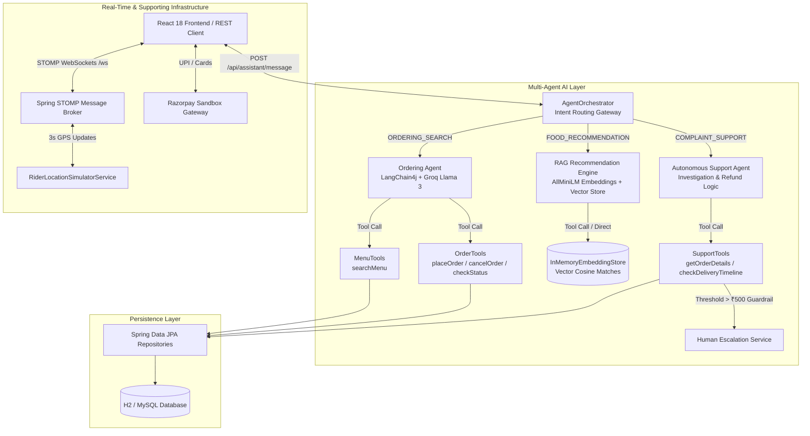

# 🥗 QuickEats — Next-Gen AI Food Delivery & Logistics Platform

[](https://github.com/shivam-shukla888/QuickEats-Ordering-System/actions/workflows/ci.yml)

**QuickEats** is an enterprise-grade food delivery and culinary logistics platform featuring an **autonomous multi-agent AI engine** (**LangChain4j + Groq Llama 3**, **Autonomous Tool Calling**, **Vector RAG**, **Hardened Java Safety Guardrails**, and **Multi-Agent Intent Orchestration**) built on top of real-time STOMP WebSocket location tracking and Razorpay payment infrastructure.

---

## ⚡ Technical Differentiation & Architecture

Unlike standard tutorial clones or simple prompt-wrapper chatbots, CraveCraft is engineered as a **production-grade agentic AI system** with real side effects and strict guardrails:

- **Autonomous Tool-Calling Agents (Not Prompt Wrappers)**: The ordering agent ([OrderingAgent.java](file:///c:/Users/thesh/QuickEats-Ordering-System/src/main/java/com/quickeats/agent/OrderingAgent.java)) and support agent ([SupportAgent.java](file:///c:/Users/thesh/QuickEats-Ordering-System/src/main/java/com/quickeats/support/SupportAgent.java)) use LangChain4j `@Tool` annotations to execute real database operations ([MenuTools.java](file:///c:/Users/thesh/QuickEats-Ordering-System/src/main/java/com/quickeats/agent/MenuTools.java), [OrderTools.java](file:///c:/Users/thesh/QuickEats-Ordering-System/src/main/java/com/quickeats/agent/OrderTools.java), [SupportTools.java](file:///c:/Users/thesh/QuickEats-Ordering-System/src/main/java/com/quickeats/support/SupportTools.java)).
- **Vector RAG with Exposed Retrieval Scores**: Combines `AllMiniLmL6V2EmbeddingModel` and `InMemoryEmbeddingStore` ([MenuEmbeddingService.java](file:///c:/Users/thesh/QuickEats-Ordering-System/src/main/java/com/quickeats/rag/MenuEmbeddingService.java)) to perform cosine similarity vector search on cravings. `POST /api/recommend` explicitly returns cosine similarity scores (`retrievalScores: List<Double>`) proving vector retrieval is happening.
- **Hardened Java Safety Guardrails**: High-stakes operations (like monetary refunds) are enforced in Java code, not trusted to LLM self-policing. `SupportTools.java` enforces a hard `₹500` threshold check (`if (amount > 500.0)`) that automatically escalates large claims to human supervisors ([EscalationRepository.java](file:///c:/Users/thesh/QuickEats-Ordering-System/src/main/java/com/quickeats/support/EscalationRepository.java)).
- **Multi-Agent Intent Orchestration**: The orchestrator ([AgentOrchestrator.java](file:///c:/Users/thesh/QuickEats-Ordering-System/src/main/java/com/quickeats/orchestrator/AgentOrchestrator.java)) acts as a single gateway endpoint (`POST /api/assistant/message`), dynamically classifying user intent and routing queries between ordering, RAG recommendation, and support agents.
- **Spring AOP Observability**: Real-time non-intrusive metric logging for LLM latency, success rates, and token consumption ([AgentObservabilityAspect.java](file:///c:/Users/thesh/QuickEats-Ordering-System/src/main/java/com/quickeats/observability/AgentObservabilityAspect.java)).

---

## 🏗️ Multi-Agent System Architecture



---

## 🔐 Persistent Authentication Architecture

QuickEats uses an enterprise-grade **Access Token (Short-Lived JWT) + Refresh Token (Long-Lived Database-Backed UUID)** authentication architecture:

- **Security Token Rotation**: Access tokens are kept short-lived (15–30 minutes) in-memory to mitigate XSS attacks. Long-lived refresh tokens (30 days) are stored securely in database table `refresh_tokens` and rotated on every use.
- **Silent Re-Authentication**: The React frontend (`AuthContext.jsx` & `axiosInstance.js`) automatically intercepts `401 Unauthorized` responses and performs silent token refresh (`POST /api/auth/refresh`) without disrupting the user session or forcing re-login on page reloads.
- **AI Agent Identity Context**: Ensures that all AI agent requests ([OrderingAgent](file:///c:/Users/thesh/QuickEats-Ordering-System/src/main/java/com/quickeats/agent/OrderingAgent.java), [SupportAgent](file:///c:/Users/thesh/QuickEats-Ordering-System/src/main/java/com/quickeats/support/SupportAgent.java), [AgentOrchestrator](file:///c:/Users/thesh/QuickEats-Ordering-System/src/main/java/com/quickeats/orchestrator/AgentOrchestrator.java)) are securely tied to the canonical `User` email identity.

---

## 🐳 Run with Docker (One-Command Deployment)

You can spin up the full production stack (**PostgreSQL 16**, **Spring Boot 3.2 Backend**, **Nginx + Vite React Frontend**, **Actuator Healthchecks**) with a single command:

```bash
# 1. Copy environment template
cp .env.example .env

# 2. Launch container cluster
docker-compose up --build -d

# Services will be available at:
# - React Frontend: http://localhost:80 (or http://localhost:5173)
# - Spring Boot Backend: http://localhost:8080/api
# - Healthcheck Endpoint: http://localhost:8080/actuator/health
```

---

## 🌐 Free Cloud Deployment (Vercel + Render)

- **React Frontend**: Deploy to **Vercel** (`QuickEats-Frontend/` directory). Pre-configured with [vercel.json](file:///c:/Users/thesh/QuickEats-Ordering-System/QuickEats-Frontend/vercel.json) for client-side routing.
- **Spring Boot Backend & Database**: Deploy to **Render.com** or **Railway.app** using the included [Dockerfile](file:///c:/Users/thesh/QuickEats-Ordering-System/Dockerfile).
- **Environment Variable**: Set `VITE_API_BASE_URL` on Vercel pointing to your deployed backend URL.

---

## 📊 AI Agent Production Observability & Monitoring

QuickEats includes a non-intrusive **Spring AOP `@Around` Interceptor** ([AgentObservabilityAspect.java](file:///c:/Users/thesh/QuickEats-Ordering-System/src/main/java/com/quickeats/observability/AgentObservabilityAspect.java)) that captures real-time telemetry across all AI agent interactions without slowing down tool-calling logic:

- **Metrics Tracked**: Execution latency (`latencyMs`), input prompt text, tools invoked, success/failure rate, and estimated Groq LLM token consumption.
- **Persistence**: Metrics are stored in table `agent_call_logs` ([AgentCallLog.java](file:///c:/Users/thesh/QuickEats-Ordering-System/src/main/java/com/quickeats/observability/AgentCallLog.java)).
- **Telemetry Endpoint**: `GET /api/admin/agent-metrics` returns aggregated system statistics for admin monitoring dashboards ([AgentObservabilityController.java](file:///c:/Users/thesh/QuickEats-Ordering-System/src/main/java/com/quickeats/observability/AgentObservabilityController.java)).
- **Admin Dashboard**: Accessible live in `AdminPage.jsx` under **📊 AI Agent Production Observability**.

---

## 🎥 Demos & Visualizations

### 🤖 Demo 1: Autonomous Conversational Ordering Agent

*Ordering Agent parses natural text, executes `@Tool searchMenu`, and places orders in real time.*

---

### 🔍 Demo 2: RAG Vector Dish Recommendation

*RAG engine embeds cravings with AllMiniLM, performs cosine similarity retrieval, and outputs exact match scores.*

---

### 🛡️ Demo 3: Autonomous Support Agent with Safety Guardrails

*Support agent investigates delivery timeline, auto-approves refunds under ₹500, and escalates high-value claims to human supervisors.*

---

## 🚀 Key Enterprise Features

### 🤖 AI Agent Layer
1. **Conversational Ordering Agent (`com.quickeats.agent`)**:
   - Uses **LangChain4j + Groq (Llama 3)** with autonomous tool calling (`@Tool searchMenu`, `@Tool placeOrder`, `@Tool checkOrderStatus`, `@Tool cancelOrder`).
   - Endpoint: `POST /api/agent/chat` returning `{ response, toolsInvoked }`.
2. **RAG Dish Recommendation Engine (`com.quickeats.rag`)**:
   - Indexes menu items into `InMemoryEmbeddingStore` using `AllMiniLmL6V2EmbeddingModel`.
   - Performs cosine vector similarity search on natural language cravings (e.g. *"something light and healthy for dinner"*).
   - Endpoint: `POST /api/recommend` returning `{ recommendedDishes, explanation, retrievalScores }`. Admin reindexing via `POST /api/recommend/reindex`.
3. **Autonomous Support & Refund Agent (`com.quickeats.support`)**:
   - Investigates complaints via `@Tool getOrderDetails` and `@Tool checkDeliveryTimeline`.
   - **Hard-Coded Java Guardrail**: Enforces strict `₹500` maximum limit for auto-approved refunds (`issueRefund`); claims > `₹500` or unverified complaints trigger `@Tool escalateToHuman` creating DB records in `escalations`.
   - Endpoint: `POST /api/support/complaint` returning `{ investigation, classification, decision, actionTaken, reasoning, toolsInvoked }`.
4. **Multi-Agent Intent Orchestrator (`com.quickeats.orchestrator`)**:
   - Single entry point (`POST /api/assistant/message`) that classifies natural user intent and routes to the appropriate specialized agent.

### 🏗️ Platform Infrastructure
- **STOMP WebSocket Live Tracking**: Zero-latency updates (`/topic/orders/{orderId}`) for live status transitions with automatic polling fallback.
- **Interactive GPS Rider Map (`LiveMap.jsx`)**: Renders OpenStreetMap Leaflet tiles with moving scooter rider pins 🛵 updating position reactively every 3 seconds via `RiderLocationSimulatorService`.
- **Indian Payment Suite & Dynamic Surge Pricing**: Integrated Razorpay test gateway, UPI options, promotional coupons (`WELCOME50`), and dynamic surge pricing engine (+10% peak dinner surge).
- **Push Notifications & Admin Dashboard**: Firebase Cloud Messaging (FCM) push notifications and real-time STOMP admin dashboard (`AdminPage.jsx`) with Web Audio API chime sounds.

---

## 🛠️ Tech Stack & Dependencies

| Layer | Technology | Usage / Purpose |
|---|---|---|
| **Language & Framework** | Java 21 / 17, Spring Boot 3.3.4 | Core enterprise application framework |
| **Agentic AI Framework** | LangChain4j 0.35.0 | Tool calling, `@SystemMessage`, `AiServices` builder |
| **LLM Provider** | Groq API (`llama-3.1-8b-instant`) | Fast inference LLM model |
| **Embedding Model** | `dev.langchain4j:langchain4j-embeddings-all-minilm-l6-v2` | ONNX All-MiniLM-L6-v2 vector embeddings |
| **Vector Store** | `InMemoryEmbeddingStore<TextSegment>` | In-memory cosine similarity vector database |
| **Real-Time WebSockets** | Spring WebSocket, STOMP, SockJS | Real-time rider GPS tracking & admin order table updates |
| **Security & Auth** | Spring Security + JJWT 0.12.5 | Stateless JWT authentication, BCrypt password hashing |
| **GIS & Mapping** | OpenStreetMap Leaflet, Nominatim Geocoding | Free map rendering, address autocomplete, OSRM routing |
| **Database** | H2 (In-Memory Dev/Test), MySQL 8 | Relational database persistence |
| **Frontend** | React 18, Vite 8, Tailwind CSS, Axios | Responsive single-page web application |

---

## 🧪 How to Test the AI Layer (Copy-Pasteable cURL Commands)

Run these `curl` commands against the backend server (`http://localhost:8080`):

### 1. Test Ordering Agent (`POST /api/agent/chat`)
```bash
curl -X POST http://localhost:8080/api/agent/chat \
  -H "Content-Type: application/json" \
  -d '{"userId": 1, "message": "show me spicy food under 300 rupees"}'
```

### 2. Test RAG Dish Recommendation with Vector Scores (`POST /api/recommend`)
```bash
# Optional: Reindex menu embeddings first
curl -X POST http://localhost:8080/api/recommend/reindex

# Run RAG vector search craving query
curl -X POST http://localhost:8080/api/recommend \
  -H "Content-Type: application/json" \
  -d '{"userId": 1, "craving": "something light and healthy for dinner"}'
```

### 3. Test Autonomous Support Agent with Safety Guardrail (`POST /api/support/complaint`)
```bash
curl -X POST http://localhost:8080/api/support/complaint \
  -H "Content-Type: application/json" \
  -d '{"userId": 1, "orderId": 1, "complaint": "The wrong item was delivered for order 1"}'
```

### 4. Test Multi-Agent Orchestrator Gateway (`POST /api/assistant/message`)
```bash
curl -X POST http://localhost:8080/api/assistant/message \
  -H "Content-Type: application/json" \
  -d '{"userId": 1, "message": "I want to complain about order 1 wrong item"}'
```

---

## 📁 Project Directory Structure

```
c:\Users\thesh\QuickEats-Ordering-System
├── src/main/java/com/quickeats
│   ├── agent/                      # LangChain4j Agent Layer
│   │   ├── AgentConfig.java        # Groq OpenAiChatModel configuration
│   │   ├── OrderingAgent.java      # Agent interface with @SystemMessage
│   │   ├── OrderingAgentService.java# Main orchestrator with tool tracker
│   │   ├── MenuTools.java          # @Tool searchMenu & recommendDishes
│   │   ├── OrderTools.java         # @Tool placeOrder, cancelOrder, checkStatus
│   │   └── ToolInvocationTracker.java # ThreadLocal tool recorder
│   ├── rag/                        # RAG Vector Embedding & Search Engine
│   │   ├── RagConfig.java          # AllMiniLM & InMemoryEmbeddingStore Beans
│   │   ├── MenuEmbeddingService.java# Menu JPA entity vector indexer
│   │   ├── MenuRetriever.java      # Cosine similarity vector search
│   │   └── RecommendationService.java# RAG retrieval + LLM generation pipeline
│   ├── support/                    # Autonomous Support & Refund Agent
│   │   ├── Refund.java             # Refund JPA entity
│   │   ├── Escalation.java         # Escalation JPA entity
│   │   ├── SupportTools.java       # @Tool with Java ₹500 safety threshold check
│   │   ├── SupportAgent.java       # Support agent interface
│   │   └── SupportAgentService.java# Complaint investigation & refund logic
│   ├── orchestrator/               # Multi-Agent Coordination Layer
│   │   └── AgentOrchestrator.java  # Intent classification & agent router
│   ├── config/                     # Spring Security, CORS, WebSockets
│   ├── controller/                 # REST Controllers (Agent, Recommend, Support, Assistant)
│   ├── model/                      # JPA Entities (User, Restaurant, Menu, Order)
│   ├── repository/                 # Spring Data JPA Repositories
│   └── service/                    # Core Business Logic (Order, User, Push Notifications)
└── QuickEats-Frontend/             # React 18 + Vite SPA Frontend
```

---

## ⚙️ Environment Setup & Local Execution

### Prerequisites
- JDK 17 or 21
- Node.js 18+ and npm
- Maven 3.6+

### Step-by-Step Execution

1. **Launch Backend Server (Port 8080):**
   ```cmd
   .\run_app.bat
   ```

2. **Launch Frontend Application (Port 5173):**
   ```cmd
   .\run_frontend.bat
   ```

3. **Access Interactive Endpoints:**
   - **Frontend Web App**: [http://localhost:5173](http://localhost:5173)
   - **Swagger OpenAPI Specs**: [http://localhost:8080/swagger-ui.html](http://localhost:8080/swagger-ui.html)
   - **H2 Database Console**: [http://localhost:8080/h2-console](http://localhost:8080/h2-console)

---

## 🧪 Automated Testing

Execute all **35 automated unit & integration tests**:

```bash
mvn clean test
```

Test coverage includes:
- **RAG Embedding & Vector Search Tests** (`MenuRagTest.java`): Verifies vector creation, cosine ranking, and retrieval scores.
- **Autonomous Support Agent Tests** (`SupportAgentServiceTest.java`): Verifies refund auto-approvals under ₹500 and human escalation above ₹500 safety threshold.
- **Multi-Agent Orchestrator Tests** (`AgentOrchestratorTest.java`): Verifies intent classification and routing.
- **Ordering Agent Tests** (`OrderingAgentServiceTest.java`): Verifies tool call tracking for search, place order, and status checks.
- **WebSocket & Real-Time Tracking Tests** (`OrderWebSocketTest.java`, `RiderLocationSimulatorTest.java`).

---

## 🎯 What I'd Build Next (Production Roadmap)

1. **Persistent Vector Database**: Upgrade from `InMemoryEmbeddingStore` to **pgvector / ChromaDB** for persistent vector indexing across server restarts.
2. **Multi-Turn Conversational Session Memory**: Integrate LangChain4j `ChatMemory` store to persist agent conversation state per user session.
3. **LLM Cost & Latency Observability**: Implement telemetry logging for per-agent token usage, execution latency, and API cost tracking using Prometheus metrics.

---

## 📜 License

MIT License. Free to adapt and use for learning or production applications.
